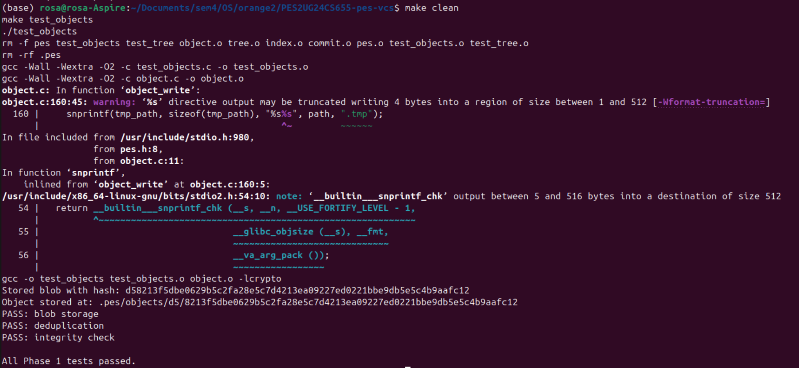
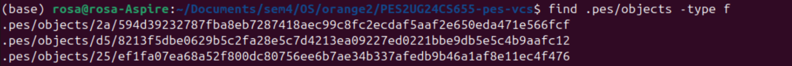
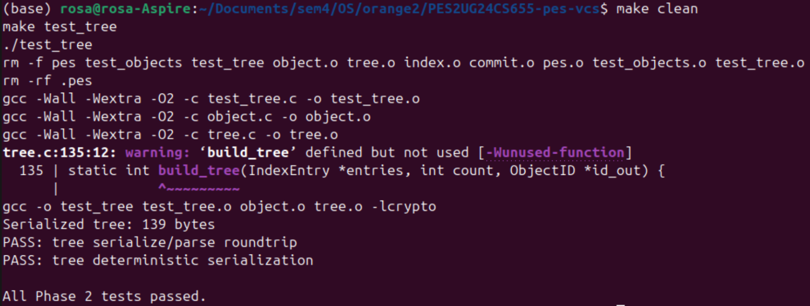
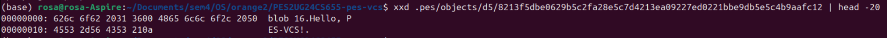
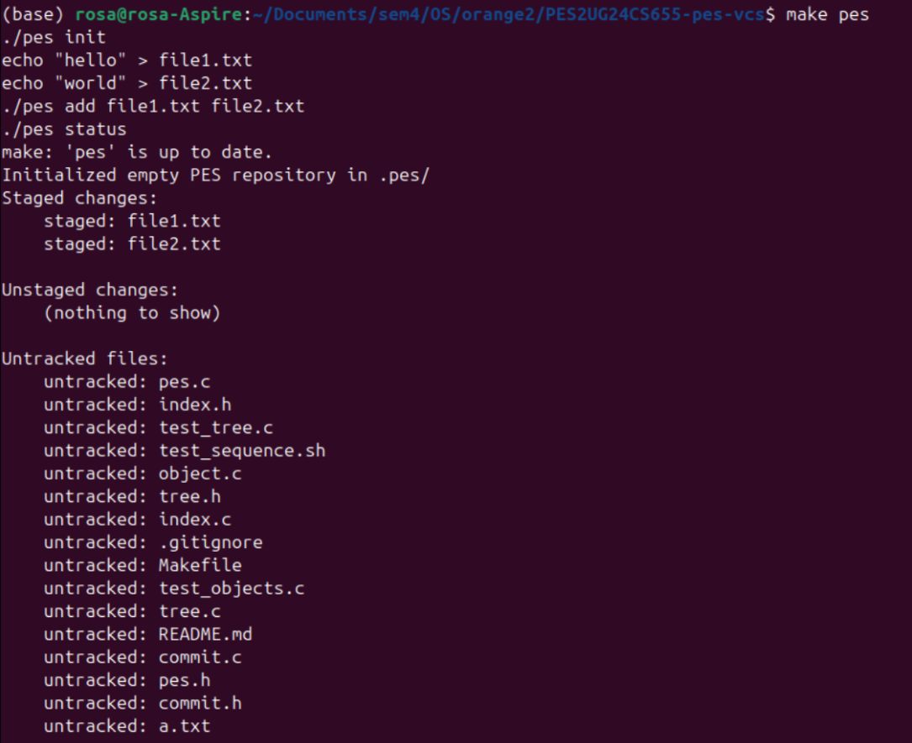
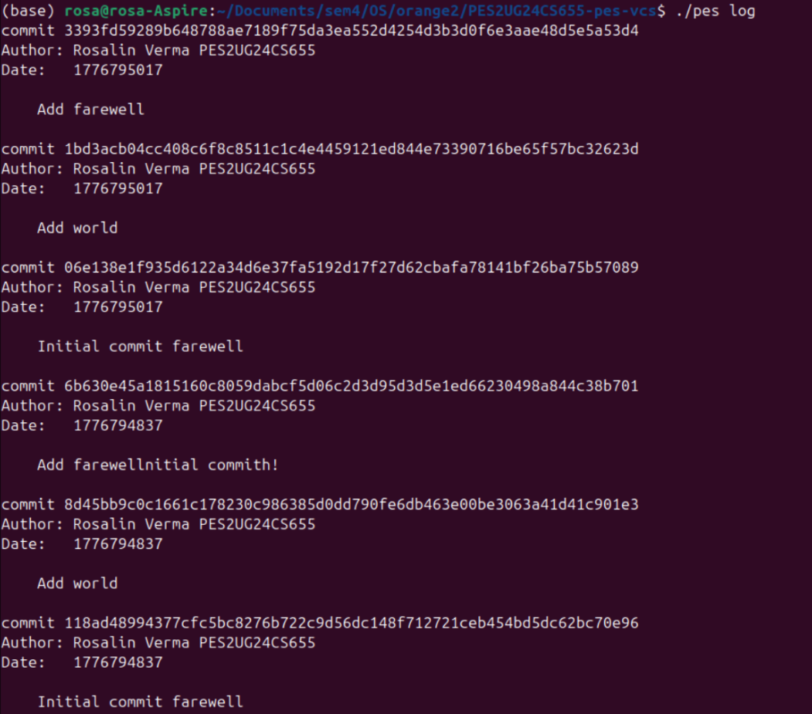
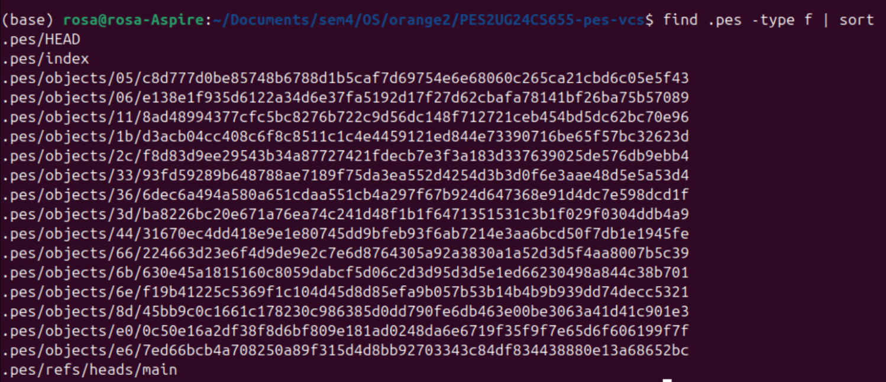
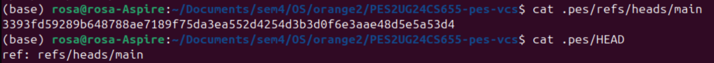
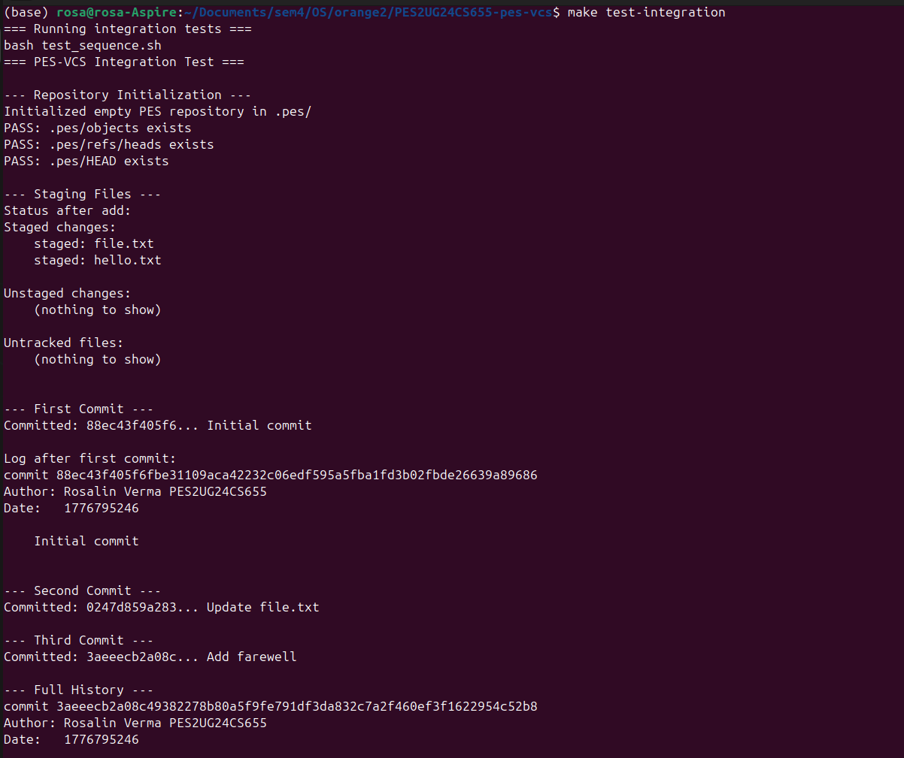
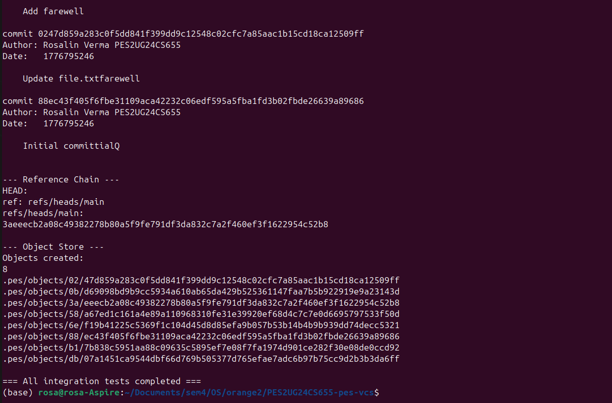

# PES-VCS — Version Control System

## Lab Report

**Name:** Rosalin Verma  
**SRN:** PES2UG24CS655  

---

## Overview

PES-VCS is a simplified version control system inspired by Git. It demonstrates core concepts such as content-addressable storage, tree structures, staging area, and commit history.

---

## Features

- Content-addressable storage using SHA-256 hashing  
- Blob and tree-based object model  
- Staging area (index) for tracking changes  
- Commit system with parent linking  
- HEAD and reference management  
- Commit history traversal  

---

## Architecture

```
Working Directory → Index → Object Store → Commits → HEAD
```

---

## Phase 1: Object Storage

- Implemented object_write and object_read  
- Stored data using SHA-256 hashing  
- Used atomic writes with directory sharding  
- Verified integrity during reads  

**Screenshots:**
- 1A: test_objects output  
  
- 1B: object store structure  


---

## Phase 2: Tree Objects

- Built hierarchical directory trees from index  
- Recursive tree construction  
- Deterministic serialization of tree objects  

**Screenshots:**
- 2A: test_tree output  
  
- 2B: raw tree object dump 


---

## Phase 3: Index (Staging Area)

- Implemented index load, save, and add  
- Stored file metadata and hashes  
- Atomic index file updates  

**Screenshots:**
- 3A: pes status output 
  
- 3B: index file contents  


---

## Phase 4: Commits

- Created commit objects with metadata  
- Linked commits using parent pointers  
- Updated HEAD after each commit  
- Implemented commit history traversal  

**Screenshots:**
- 4A: commit log  
  
- 4B: object store growth  
  
- 4C: HEAD and refs  


---

## Integration Test

- Full workflow tested using provided test suite  



---

## Phase 5 and 6: Analysis Questions

**Q5.1**  
Checkout would update .pes/HEAD to the target branch, rebuild working directory from the branch’s commit tree, and reset .pes/index to match it. It is complex due to full tree reconstruction and risk of overwriting local uncommitted changes.

**Q5.2**  
Detects dirty state by comparing index vs working directory and index vs target branch snapshot; if a tracked file differs in working directory from index and also differs between index and target commit, refuse checkout.

**Q5.3**  
Commits made in detached HEAD exist but are not linked to any branch and may become unreachable later. They can be recovered using reflog and then attaching them to a new branch.

**Q6.1**  
Use mark-and-sweep starting from all branch heads, traversing commits, trees, and blobs to mark reachable objects; with 100k commits and 50 branches, typically only reachable history is visited, often proportional to reachable commits not total objects.

**Q6.2**  
GC is dangerous during commit because it may delete objects not yet fully referenced by a new commit, causing broken history. Git avoids this using reachability locking, atomic updates, and temporary protection of in-progress objects.

---

## Build Instructions

```
make
./pes init
```

---

## Conclusion

This project demonstrates how Git-like systems work internally using object storage, staging, and commit history.
